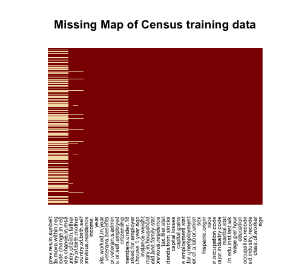

## 1. Import Data into R

The original csv files are not well formatted: variable names are included in the metadata file and values are separated by *comma and space*. However, R's `read.table()` function accepts only one byte separator, and `sep=', '` will cause an error. We'll modify both files directly by inserting variable names in the first row and removing additional spaces after commas. Then the `read.csv()` function is applied to import csv-format file into R's data frame. All variables of string values and several variables of numerical values are transformed to factors, according to the metadata file. 

```{r, cache=TRUE, warning=FALSE, message=FALSE}
# import data
census_train = read.csv("./us_census/census_learn.csv", stringsAsFactors = TRUE, na.strings="?")
census_test = read.csv("./us_census/census_test.csv", stringsAsFactors = TRUE, na.strings="?")

# deliver a label
census_train$train = 1
census_test$train = 0
# combine training and test data for preprocessing
census_data = rbind(census_train, census_test)

# transform numerical variables to nomial 
num_to_nom = c("detailed.industry.recode", "detailed.occupation.recode", "own.business.or.self.employed", "veterans.benefits", "year")
census_data[, num_to_nom] = lapply(census_data[, num_to_nom], as.factor)
```

## 2. Exploratory Data Analysis

The training data set contains 199523 observations, 6.2% of which have 50k+ income and the remaining 93.8% have -50k income. There are 42 variables in total, 7 continuous and 32 categorical. The test data set contains 99762 observations, and the training:testing ratio is 2:1. Through exploratory analysis, we would like to examine the relation between predictor variables and the target variable. Data preprocessing tasks such as missing and extreme value treatment are also conducted.

```{r, warning=FALSE, message=FALSE}
# packages for exploratory data analysis
library(dplyr)
library(ggplot2)
options(digits=2)
```

### Missing Values

Yellow lines in the following graph represent missing values, variables are on the x-axis and observations are on the y-axis. The vast majority of missing values are due to 4 variables concerning migration: `migration.code.change.in.msa`, `migration.code.change.in.reg`, `migration.code.move.within.reg`, and `migration.prev.res.in.sunbelt`. Each of them has about 75% missing values, and individuals tend to answer all or non of them. Considering the large proportion of missing data and the non-randomness, we'll treat them as a separate category. 

The variable `country.of.birth.father`, `country.of.birth.mother`, and `country.of.birth.self` contain respectively 5%, 4.61%, and 2.58% missing values, who often occur together. We could apply multivariate imputation methods to fill in the missing values. But in view of the delicateness of imputation and the relatively small proportion of missing values, we'll just remove these incomplete observations.


```{r}
# library(Amelia)
# very slow
# missmap(census_data, main="Missing Map of Census training data", legend = F, x.cex = 0.6, y.cex = 0.01)

# proportion of missing values by variable
VarsWithNA = sapply(census_data, function(x) {sum(is.na(x))}) / nrow(census_train)
sort(VarsWithNA[VarsWithNA > 0], decreasing = TRUE)

# treat NAs as a new category
migration_vars = c("migration.code.change.in.msa", "migration.code.change.in.reg", "migration.code.move.within.reg", "migration.prev.res.in.sunbelt")
census_data[, migration_vars] = lapply(census_data[, migration_vars], addNA)

# delete observations with NA in other variables
census_data = na.omit(census_data)
```


### Variable Distribution

By analyzing variable distribution, we would like to identify influential factors of income and detect outliers. 

#### Age

According to the following graph, people from the `50k+` group are older than those from the `-50k` group. This is intuitive because older people are more experienced and tend to earn more money. Almost all children are in the `-50k` group since they normally have no income. It's evident that income is not-linearly related to age, people aged from 40 to 50 have higher salary, while younger and older people tend to gain less. To capture this non linearity, we'll discretize age into 7 categories: [0, 20], [20,30], [30, 40], [40,50], [50,60], [60,75], [75,90], so that ages with similar income belong to the same group.

```{r, echo=FALSE, fig.width=4, fig.height=4}
# boxplot income by age
qplot(income, age, data=census_data, geom = "boxplot", main = "Income by Age")

ggplot(census_data, aes(x=age, fill=income)) + 
  geom_histogram(binwidth=4, alpha=.6, position="identity") + 
  ggtitle("Distribution of Age")

# discretize age 
census_data$age = cut(census_data$age, breaks=c(-1, 20, 30, 40, 50, 60, 75, 90))
```


#### Class of worker

The following graph describes the proportion of people work in different sectors of each group. We can see that more people in the `50k+` group are self-employed or work in the private sector. And more than a half of those who from the `-50k` group have answered `Not in universe`. In addition, `never worked` and `without pay` are strong indicators that an individual belongs to the `-50k` group.

```{r,echo=FALSE, fig.width=7, fig.height=5}
# class of worker
group_by_class = census_data %>% 
  group_by(income, class.of.worker) %>% 
  summarise(count = n()) %>% 
  mutate(per=round(count/sum(count)*100, 2))

ggplot(group_by_class, aes(x=class.of.worker, y=per, fill=income)) + 
  geom_bar(stat="identity", position="dodge") + 
  ggtitle("Income by Class of Worker") + 
  ylab("Percentage") + xlab("Class of worker") +
  theme(axis.text.x = element_text(angle = 20))
```


#### Education 

Income is closely associated with education, and people from the `50k+` group tend to have higher education levels such as Bachelors degree or Doctorate degree. Having a PHD, Master, or Prof school degree is a cue that someone belongs to the `50k+` group. We also note that categories such as `10th grade`, `11th grade` and `12th grade no diploma` are homogenous; we'll combine them into a new category `less than 12th grade`. Besides, we could transform education to ordered factors or the corresponding education year since education levels are naturally ordered. 

```{r, echo=FALSE, fig.width=7, fig.height=6}
# education
group_by_edu <- census_train %>% 
  group_by(income, education) %>% 
  summarise(count = n()) %>% 
  mutate(per=round(count/sum(count)*100, 2))

ggplot(group_by_edu, aes(x=education, y=per, fill=income)) + 
  geom_bar(stat="identity", position="dodge") + 
  ggtitle("Income by Education") + 
  ylab("Percentage") + xlab("Education") +
  theme(axis.text.x = element_text(angle = 90))
```
```{r}
# combine homogenous categories
categories_to_combine <- c("10th grade", "11th grade", "12th grade no diploma", "1st 2nd 3rd or 4th grade", "5th or 6th grade", "7th and 8th grade", "9th grade", "Less than 1st grade")

levels_edu = levels(census_data$education) 
levels_edu[levels_edu %in% categories_to_combine] = "less than 12th grade"
levels(census_data$education) = levels_edu
```


#### Wage per hour

94% of observations have an hourly wage of 0 and extremely high values such as 9999 are quite frequent. The truncated graph shows that the distribution is right skewed, and most of the wages are less than 2500. This distribution is questionable considering that the minimum hourly wage in US is $7.25, and we'll exclude it from our data. 

```{r, fig.width=4, fig.height=4}
# truncated graph, y ranges from 0 to 3000
ggplot(census_train, aes(x=wage.per.hour)) +
  geom_bar(binwidth=200) + 
  coord_cartesian(ylim = c(0, 3000)) +
  ggtitle("Distribution of Wage Per Hour")
```
```{r}
# wage per hour
quantile(census_train$wage.per.hour, probs = seq(0.94, 1, 0.01)) # quantile
# proportion of people with 0 hourly wage
sum(census_train$wage.per.hour == 0)/nrow(census_train) 

# remove wage per hour
census_data$wage.per.hour = NULL
```


#### Marital Status, Sex, Industry, Occupation

According to the following graphs, married people with spouse present tend to have higher income, and those who are either widowed or never married tend to have lower income. Regarding to sex, male tend to have higher income than female, unfortunately.

Industry and occupation are also relevant to income. People work in industries such as finance, insurance, or real estate, and those who have a executive or managerial role tend to have higher income. 

```{r, echo=FALSE, fig.width=7, fig.height=6}
# marital status
group_by_marital <- census_train %>% 
  group_by(income, marital.stat) %>% 
  summarise(count = n()) %>% 
  mutate(per=round(count/sum(count)*100, 2))

ggplot(group_by_marital, aes(x=marital.stat, y=per, fill=income)) + 
  geom_bar(stat="identity", position="dodge") + 
  ggtitle("Income by Marital Status") + 
  ylab("Percentage") + xlab("Marital Status") +
  theme(axis.text.x = element_text(angle = 20))

# sex
group_by_sex = census_train %>% 
  group_by(income, sex) %>% 
  summarise(count = n()) %>% 
  mutate(per=round(count/sum(count)*100, 2))

ggplot(group_by_sex, aes(x=sex, y=per, fill=income)) + 
  geom_bar(stat="identity", position="dodge") + 
  ggtitle("Income by Sex") + 
  ylab("Percentage") + xlab("Sex")

# industry
group_by_industry <- census_train %>% 
  group_by(income, major.industry.code) %>% 
  summarise(count = n()) %>% 
  mutate(per=round(count/sum(count)*100, 2))

ggplot(group_by_industry, aes(x=major.industry.code, y=per, fill=income)) + 
  geom_bar(stat="identity", position="dodge") + 
  ggtitle("Income by Industry") + 
  ylab("Percentage") + xlab("Industry") +
  theme(axis.text.x = element_text(angle = 90))

# occupation
group_by_occupation <- census_train %>% 
  group_by(income, major.occupation.code) %>% 
  summarise(count = n()) %>% 
  mutate(per=round(count/sum(count)*100, 2))

ggplot(group_by_occupation, aes(x=major.occupation.code, y=per, fill=income)) + 
  geom_bar(stat="identity", position="dodge") + 
  ggtitle("Income by Occupation") + 
  ylab("Percentage") + xlab("Occupation") +
  theme(axis.text.x = element_text(angle = 90))
```

#### Race, Unemployment

The gap between different races is not so obvious, although `asian or pacific islander` and `white` tend to have a slightly higher income. We've also found some inconsistent observations regarding `reason.for.unemployment` and `full.or.part.time.employment.stat`. 518 unemployed individuals have responded `Not in univers` for the question `reason.for.unemployment`. We'll remove these inconsistent data.

```{r, fig.width=6, fig.height=5}
# race
group_by_race = census_train %>% 
  group_by(race, income) %>% 
  summarise(count = n()) %>% 
  mutate(per=round(count/sum(count)*100, 2))

ggplot(group_by_race, aes(x=race, y=per, fill=income)) + 
  geom_bar(stat="identity", position="dodge") + 
  ggtitle("Income by Race") + 
  ylab("Percentage") + xlab("Race") +
  theme(axis.text.x = element_text(angle = 40))
```
```{r}
# remove inconsistent data
inconsistent_individuals = census_data$full.or.part.time.employment.stat %in% c("Unemployed full-time", "Unemployed part-time") & census_data$reason.for.unemployment == "Not in universe"
census_data = census_data[!inconsistent_individuals, ]
```


#### Extreme Values

Among all individuals, 96% have 0 capital gain, 98% have 0 capital loss, and 89% have 0 dividends from stocks. Extreme values are observed in `capital.gains` and `dividends.from.stocks`. We've also found inconsistent individuals who have a net capital gain (capital gain - capital loss + dividends) greater than 50k but an income less than 50k. And the fact that many of them have 99999 capital gains is dubious. 

Concerning the variable `weeks.worked.in.year`, 48% have worked 0 hours in a year, 35% have worked 52 weeks, and the remaining 17% have worked between 1 week and 51 weeks. To neutralize the effect of extreme values, we'll discretize these variables into categories. For example, `capital.gains` is discretized into 7 categories: 0, (0,5e3], (5e3,1e4], (1e4,1.5e4], (1.5e4,2e4], (2e4, 5e4], and (5e4,1e5].

##### NOTE

It's important to mention that our discretization based on incomplete analysis of distribution is sloppy and flawed. A careful study should be carried out to determine adequate discretization intervals, and methods based on chi-square or  heuristics could be used to automate the decision. We'll stick with our intervals just for the purpose of demonstration.

```{r, echo=FALSE, fig.width=4, fig.height=4}
# capital gains
ggplot(census_train, aes(x=capital.gains)) +
  geom_bar(binwidth=1000) + coord_cartesian(ylim = c(0, 1500)) +
  ggtitle("Distribution of Capital gains")

# capital losses
ggplot(census_train, aes(x=capital.losses)) +
  geom_bar(binwidth=200) + coord_cartesian(ylim = c(0, 2500)) +
  ggtitle("Distribution of Capital Losses")

# dividends from stocks
ggplot(census_train, aes(x=dividends.from.stocks)) +
  geom_bar(binwidth=1000) + coord_cartesian(ylim = c(0, 1500)) +
  ggtitle("Distribution of Dividends from Stocks")

# weeks worked in year
ggplot(census_train, aes(x=weeks.worked.in.year)) +
  geom_bar(binwidth=1) +
  ggtitle("Distribution of Weeks Worked in Year")
```
```{r}
# remove inconsistent data
dubious_individuals = (census_data$capital.gains - census_data$capital.losses + census_data$dividends.from.stocks) >= 50000 & census_data$income == "-50000"
census_data = census_data[!dubious_individuals, ]

# discretize variables
census_data$capital.gains = cut(census_data$capital.gains, breaks = c(-1, seq(0, 20000, 5000), 50000, 100000))
census_data$capital.losses = cut(census_data$capital.losses, breaks = c(-1, seq(0, 3000, 500), 5000))
census_data$dividends.from.stocks = cut(census_data$dividends.from.stocks, breaks = c(-1, seq(0, 20000, 5000), 50000, 100000))
census_data$weeks.worked.in.year = cut(census_data$weeks.worked.in.year, breaks = c(-1, seq(0, 48, 8), 51, 52))
```


#### Correlated Variables

The variable `detailed.household.and.family.stat` is a refined version of `detailed.household.summary.in.household`, thus they contain very similar information. According to the following graph, a more detailed definition of household and family status helps little in predicting income. We might as well just keep the more succinct variable `detailed.household.summary.in.household`. For the same reason, we'll also remove `detailed.industry.recode` and `detailed.occupation.recode`.

The 4 variables concerning migration are highly correlated to each other. For instance, the following contingency table crosses `migration.code.move.within.reg` and `migration.code.change.in.reg`. The sparsity of this table is a prominent signal of correlation, which is further confirmed by the fact that (Nonmover, Nonmover) = 118766, (<NA>, <NA>) = 142699 and that these two categories account for more than 90% of the data.

##### NOTE

A careful analysis and preprocessing of all variables should be conducted, and later on we rely on variable selection techniques to eliminate correlation and multicollinearity in the model. Besides, multiple correspondence analysis could be applied for a more complete analysis of correlations. 

```{r, echo=FALSE, fig.width=7, fig.height=6}
group_by_household = census_train %>% 
  group_by(detailed.household.and.family.stat, income) %>% 
  summarise(count = n()) %>% 
  mutate(per=round(count/sum(count)*100, 2))

ggplot(group_by_household, aes(x=detailed.household.and.family.stat, y=per, fill=income)) + 
  geom_bar(stat="identity", position="dodge") + 
  ggtitle("Income by Househould and Family Status") + 
  ylab("Percentage") + xlab("Househould and Family Status") +
  theme(axis.text.x = element_text(angle = 90))
```
```{r}
# contingency table
t = table(census_data$migration.code.move.within.reg, census_data$migration.code.change.in.reg)
unname(t)

# remove redundant variables
vars_to_remove = c("detailed.household.and.family.stat", "detailed.industry.recode", "detailed.occupation.recode", "migration.prev.res.in.sunbelt", "migration.code.change.in.reg", "migration.code.move.within.reg", "migration.code.change.in.msa", "instance.weight")
census_data = census_data[, !(names(census_data) %in% vars_to_remove)] 
```


## 3. Income Prediction

In the previous section, we've examined some social-demographic variables and their relations to income, and processed missing and extreme values. For income prediction, we'll compare three models: Penalized Logistic Regression, Random Forest, and Gradient Boosting. These models are well adapted to our data, where the majority of variables are categorical. 

Variable selection is crucial in building predictive models, because as we have already seen, there are much noisy and redundant information in the data. In addition, we'll use parallel computing to speed up the tuning process with the help of the package `doMC`.

### Imbalanced Data and Resampling

The training data is imbalanced, where the `-50k` class is under-represented with a total proportion of 6.2%. The goal of classifiers is to maximize the global accuracy, as a result, the class priors are biased strongly in favor of the majority class and the minority class error rate would be very high. We'll use SMOTE (Synthetic Minority Over-sampling Technique) to balance our training data set in the first place. The idea of SMOTE is to under-sample the majority class and over-sample the minority class, it has 3 tuning parameters:

  * `k`: the nearest neighbors used to generate the new examples of the minority class.
  * `perc.over`: the over-sampling rate.
  * `perc.under`: the under-sampling rate. 

We should use cross validation to tune these parameters. But for the purpose of demonstration, we fix `k=5`,`perc.over=300` and `perc.under=400`. That means we quadruple the size of the minority class, and the majority class size is three times the size of the minority class. In the balanced data, the minority class proportion is 25%.

```{r, echo=FALSE}
# change factor names, caret package doesn't accept numerical factor names
levels(census_data$own.business.or.self.employed) = c("zero", "one","two")
levels(census_data$veterans.benefits) = c("zero","one","two")
levels(census_data$year) = c("ninety four","ninty five")
levels(census_data$income) = c("low", "high")
```
```{r, cache=TRUE, message=FALSE}
# recovery training and test data
census_train = census_data %>% filter(train == 1) %>% select(-train)
census_test = census_data %>% filter(train == 0) %>% select(-train)

# !TEST sampling to reduce size of data
# census_train = census_train[sample(1:nrow(census_train), size = round(nrow(census_train)/10)),]
# census_test = census_test[sample(1:nrow(census_test), size = round(nrow(census_test)/10)),]

# SMOTE
library(DMwR)
set.seed(1234)
census_train_smoted = SMOTE(income ~ .,
                            data = census_train,
                            k = 5,
                            perc.over = 300,
                            perc.under = 400)
```


### Penalized Logistic Regression

The predictor variables are primarily categorical and many of them contain a large number of modalities. Logistic regression usually has difficulty classifying this kind of data, because the target variable tends to be perfectly separable in the presence of too many dummy variables. 

Variable selection is an important issue because our data contains much superfluous information. Irrelevant variables can obscure the effects of pertinent variables and cause over-fitting. Stepwise logistic regression is generally bad for variable selection, and we'll apply logistic regression with elastic-net penalty. There are two tuning parameters:
  
  * the mixing percentage $\alpha$ which bridges the gap between lasso($\alpha$=1) and ridge($\alpha$=0).
  * $\lambda$ which controls the overall strength of penalty.

We fix $\alpha$=1 to use L1 penalization, this would penalize more coefficients to 0 and is good for demonstration. According to the following graph, more and more coefficients are penalized to 0 as we increase $\lambda$. We'll use 10-fold cross validation and mean cross validation error to tune $\lambda$, and we will chose the largest $\lambda$ at which the MSE is within one standard error of the minimal MSE.

```{r, cache=TRUE, message=FALSE}
library(caret)
library(pROC)
library(doMC) # parallel computing
registerDoMC(cores=4)

# logistic regression with L1 penalization
# can't fix alpha with caret package, use cv.glmnet instead
library(glmnet)
set.seed(1234)
glmnet_fit = cv.glmnet(model.matrix(income ~ . , data=census_train_smoted),
                       census_train_smoted$income,
                       family = "binomial", 
                       alpha = 1, 
                       nfolds = 10,
                       parallel=TRUE)

# lambda and penalization strength
plot(glmnet_fit$glmnet.fit)

# 1se lambda value
glmnet_fit$lambda.1se
```

Penalized logistic regression gives us a rather parsimonious model. Many coefficients of the following variables are penalized to 0: `country.of.birth.self`, `detailed.household.summary.in.household` `country.of.birth.mother`, `country.of.birth.father`, `citizenship`, `family.members.under.18`, `state.of.previous.residence`, `region.of.previous.residence`, and `year`. This reveals that the country a person or his/her parents are born have little effect on income. Neither do previous state or region of residence. Moreover, survey year, household conditions, and number of family members under 18 are all non-discriminant factors of income.

```{r, results="hide"}
# penalized coefficients
coef(glmnet_fit, s = "lambda.1se")
```


### Random Forest

Random Forest is an off-the-shelf method that can be directly applied to the data without too much data preprocessing or parameter tuning. RF is based on decision trees, which naturally incorporate mixtures of numeric and categorical predictors, and are resistant to extreme and missing values. Furthermore, they perform internal variable selection as an integral part of the procedure. However decision trees seldom provide satisfactory predictive accuracy. RF improves accuracy by aggregating a large number of decision trees, at the expense of interpretability. The only tuning parameter of RF is `mtry`, the number of variables to be sampled at each node split.

```{r, cache=TRUE, message=FALSE}
# 10-fold cross validation
fitCtrl = trainControl(method = "cv",
                       number = 10,
                       summaryFunction = twoClassSummary,
                       allowParallel = TRUE,
                       classProbs = TRUE)

# random forest
library(randomForest)
default_mtry = round(sqrt(ncol(census_train_smoted)))

set.seed(1234)
rf_fit = train(x = select(census_train_smoted, -income),
               y = census_train_smoted$income,
               method = "rf",
               tuneGrid = expand.grid(mtry = seq(default_mtry - 1, default_mtry + 1, 1)),
               metric = "ROC",
               trControl = fitCtrl)
```

According to the following graph of variable importance, significant predictors of income include: `occupation`, `education`, `industry`, `country.of.birth.self`, `sex`, `weeks worked in year`, etc. This result is coherent with that of the exploratory analysis. And not surprisingly, many variables are insignificant, including: `enroll.in.edu.inst.last.wk`, `fill.inc.questionnaire.for.veteran.s.admin`, `reason.for.unemployment`, `family.members.under.18`, `veterans.benefits`, `region.of.previous.residence`, `year`, etc. Note that most of them are also insignificant in the penalized logistic regression model.


```{r}
# variable importance
rf_imp = varImp(rf_fit, scale = T)
plot(rf_imp)
```

### eXtreme Gradient Boosting

Gradient boosting is another ensemble learning method. Starting with a weak learner (decision tree in our case), it improves the model iteratively by focusing on difficult cases. XGBoost is a fast implementation of gradient boosting, there are 3 tuning parameters: 

  * boosting iterations.
  * maximum tree depth.
  * shrinkage.

```{r, cache=TRUE, message=FALSE}
# eXtreme Gradient Boosting
library(xgboost)
set.seed(1234)
xgb_fit = train(income ~ .,
               data = census_train_smoted,
               method = "xgbTree",
               tuneGrid = expand.grid(nrounds = seq(3, 5),
                                      max_depth = seq(4, 8),
                                      eta = c(0.01, 0.05, 0.1, 0.15)),
               metric = "ROC",
               trControl = fitCtrl)
```

The following graph shows important variables of the gradient boosting model. We can see that number of persons worked for employer, whether a person is born in US and has a US-born mother or father are influential factors of income.

```{r}
# final parameters
xgb_fit$bestTune

# variable importance
xgb_imp = varImp(xgb_fit, scale = T)
plot(xgb_imp, top = 10)
```


### Model Evaluation

Three models all have the same AUC of 0.93 and a very close global accuracy. Random Forest is distinguished for its perfect prediction of the `-50k` class (99.4% precision), and for its inefficiency in predicting the `+50k` class (24.7% precision). Gradient Boosting has a slightly lower TP rate of 97.2% and a higher TN rate of 31.2%. Penalized LR makes more compromise between TP and TN, it has the lowest TR rate of 95.4% but a much higher TN rate of 57.1%. 

| Model               | Global Accuracy | True positive rate   | True negative rate  |
| ------------------- | --------------- | -------------------- | ------------------- |
| Penalized LR        | 93.1%           | 95.4%                | 57.1%               |
| Random Forest       | 94.8%           | 99.4%                | 24.7%               |
| Gradient Boosting   | 93.2%           | 97.2%                | 31.2%               |


```{r, warning=FALSE, message=FALSE}
# prediction of Penalized LR
glmnet_pred = predict(glmnet_fit, newx = model.matrix(income ~ . , data=census_test), 
                     s = "lambda.1se", type="class")
confusionMatrix(glmnet_pred, census_test$income)

# prediction of RF
rf_pred = predict(rf_fit, census_test)
confusionMatrix(rf_pred, census_test$income)

# prediction of XGB
xgb_pred = predict(xgb_fit, census_test)
confusionMatrix(xgb_pred, census_test$income)
```
```{r, echo=FALSE, warning=FALSE, message=FALSE}
# ROC
library(pROC)
# ROC RF
rf_probs = predict(rf_fit, census_test, type = "prob")
rf_ROC = roc(response = census_test$income, predictor = rf_probs$low)
plot(rf_ROC, type = "S", col = "#0072B2")

# ROC penalized LR
glmnet_probs = predict(glmnet_fit, newx = model.matrix(income ~ . , data=census_test), 
                       s = "lambda.1se", type="response")
glmnet_ROC = roc(response = census_test$income, predictor = glmnet_probs[,1])
plot(glmnet_ROC, add = TRUE, col = "#E69F00")

# ROC XGB
xgb_probs = predict(xgb_fit, census_test, type = "prob")
xgb_ROC = roc(response = census_test$income, predictor = xgb_probs$low)
plot(rf_ROC, add = TRUE, col = "red")

legend("bottomright", cex = 0.7, pch = 15, legend = c("Random Forest", "Regularized LR", "Gradient Boosting"), col = c("#0072B2", "#E69F00", "red"))
```